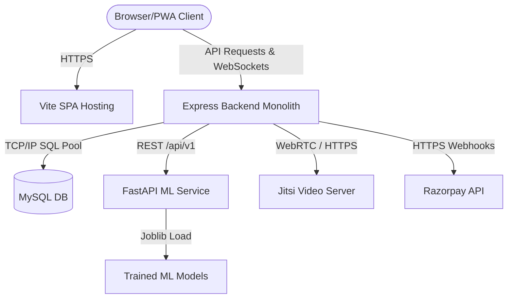
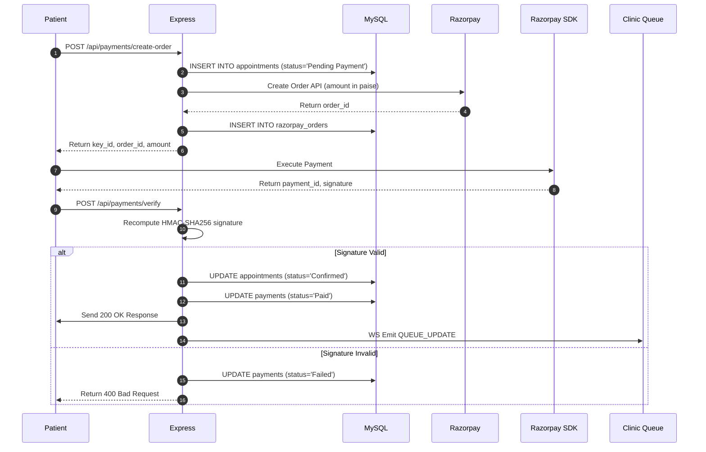
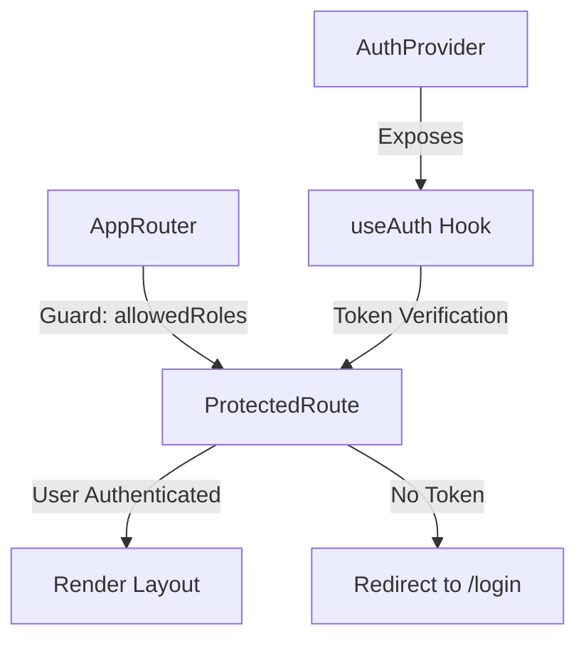
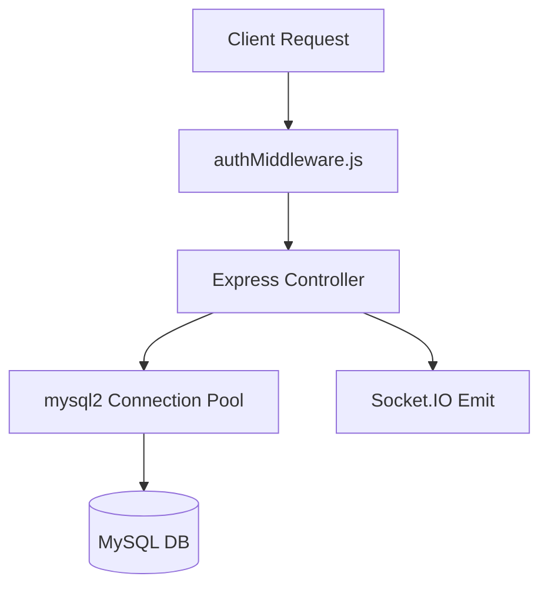
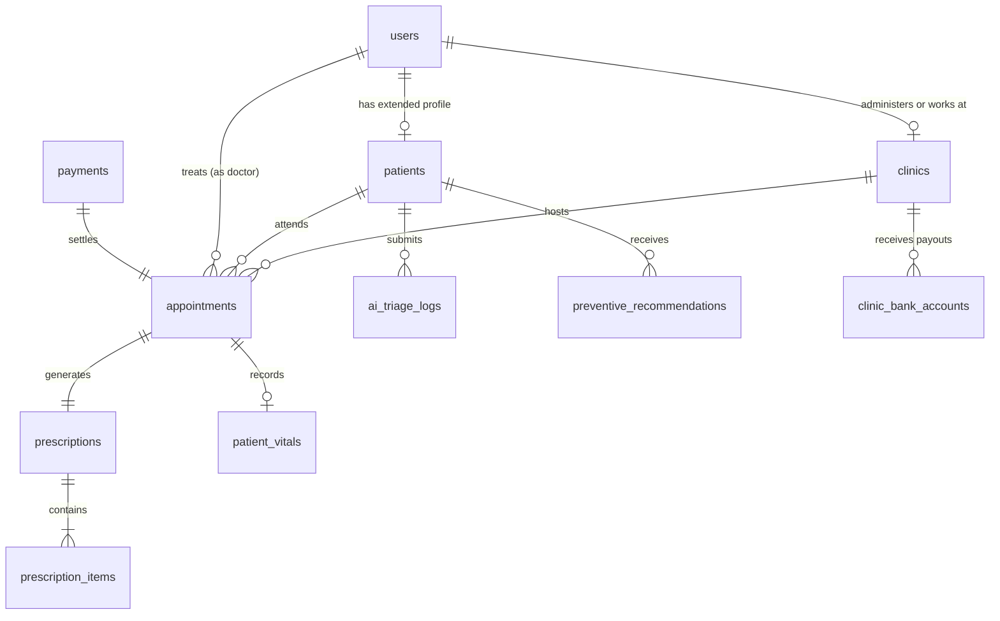
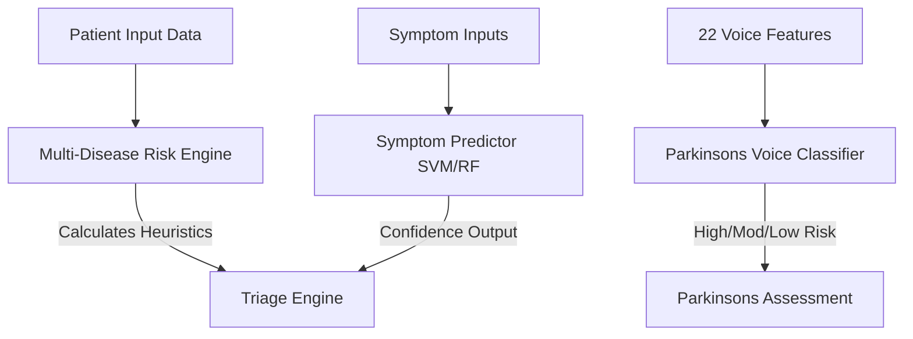
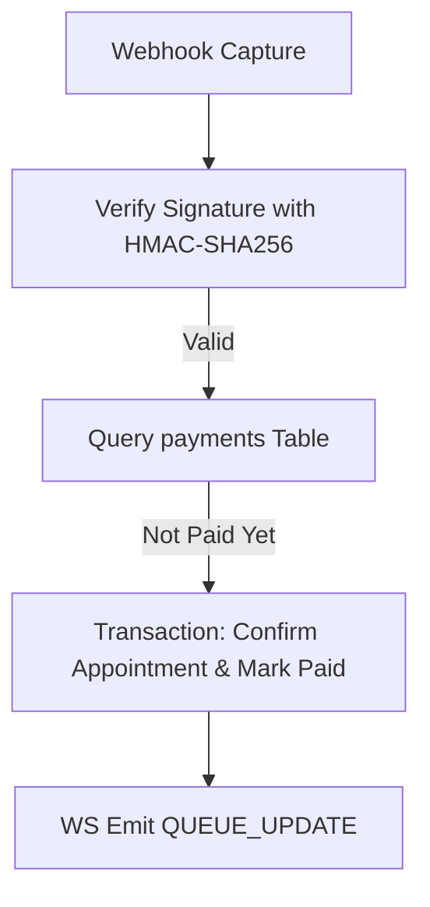
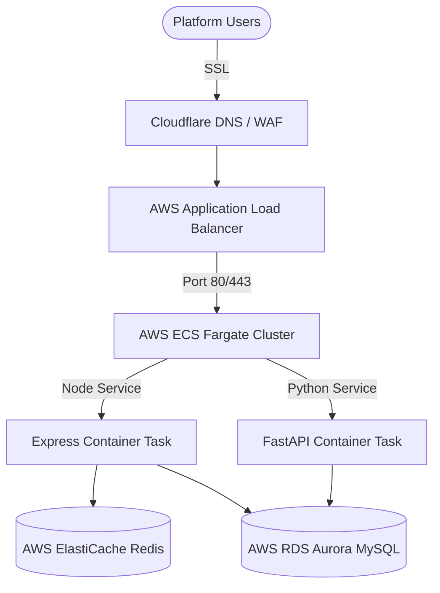
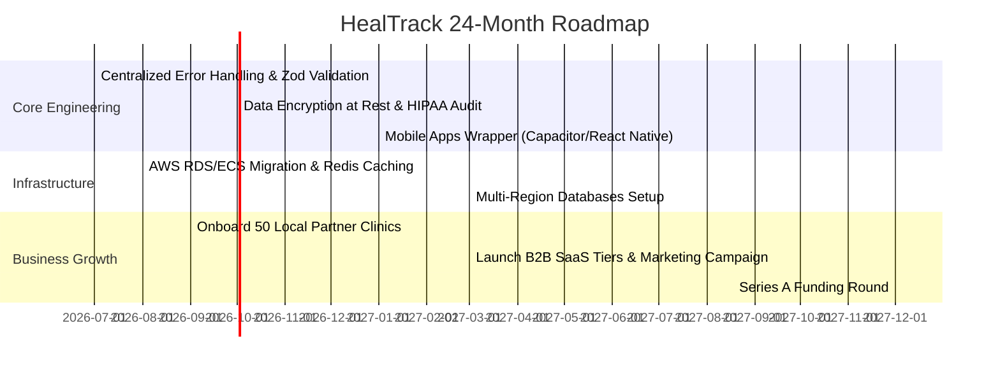

# HealTrack Technical Audit & Startup Review
**Document Version:** 1.0.0  
**Audit Date:** July 6, 2026   
**Scope:** Full-Stack Codebase (React Frontend, Express Backend, FastAPI ML Service, MySQL DB Schema, Razorpay Payments)

---

## Table of Contents
1. [Volume 1 — Executive Review](#volume-1--executive-review)
2. [Volume 2 — Architecture Audit](#volume-2--architecture-audit)
3. [Volume 3 — Frontend Audit](#volume-3--frontend-audit)
4. [Volume 4 — Backend Audit](#volume-4--backend-audit)
5. [Volume 5 — Database Audit](#volume-5--database-audit)
6. [Volume 6 — AI Audit](#volume-6--ai-audit)
7. [Volume 7 — Security Audit](#volume-7--security-audit)
8. [Volume 8 — Payment Audit](#volume-8--payment-audit)
9. [Volume 9 — Performance Audit](#volume-9--performance-audit)
10. [Volume 10 — Infrastructure Audit](#volume-10--infrastructure-audit)
11. [Volume 11 — Startup Audit](#volume-11--startup-audit)
12. [Volume 12 — Product Audit](#volume-12--product-audit)
13. [Volume 13 — Roadmaps](#volume-13--roadmaps)

---

## Volume 1 — Executive Review

### Executive Summary
HealTrack is a multi-tenant, cloud-based Outpatient Department (OPD) queue manager, digital prescription, AI-driven triage assistant, and epidemiological outbreak monitoring system. It caters to five roles: Patients, Doctors, Clinic Staff (Receptionists), Clinic Admins, and Super Admins. The system features integrations with Razorpay for transactional healthcare payments, Jitsi Meet for teleconsultations, Leaflet for geospatial outbreak tracking, and PWA configuration for offline capabilities.

### Current Product Maturity
HealTrack is currently at a **Late Beta / Release Candidate 1 (RC1)** state. 
* **Core Workflows**: Appointment booking, queue progression, prescription creation, telemetry collection, and billing are fully operational.
* **Integrations**: Live integrations with payment processors and ML prediction endpoints are completed.
* **Production Gaps**: Unified backend exception handling, automated DB replication, rate-limiting, and comprehensive logging are yet to be hardened for scale.

### Startup Readiness Score
**Score: 82 / 100**
* **Strengths**: High functional coverage, multi-tenant database partitioning, localization support (English, Hindi, Punjabi), and automated clinic-onboarding queue.
* **Opportunities**: Mobile-app wrappers (Capacitor/React Native) to replace desktop-only responsive views for patient engagement, and a more robust subscription invoicing system for B2B clinics.

### Investor Readiness Score
**Score: 85 / 100**
* The unit economics are well-structured with transaction-based commission splits (platform fee) and recurring SaaS tiers. 
* High investability due to the inclusion of actionable AI components (Parkinson's testing, outbreak predictive scheduling) that provide strong defensibility (IP moat).

### Production Readiness
**Score: 78 / 100**
* **Critical Path**: Must transition the backend from manual MySQL queries in controllers to an Object-Relational Mapper (ORM) to eliminate raw query injection risks.
* **Infrastructure**: Production instances are currently set up on Render (free/starter tiers), requiring migration to AWS or GCP (EKS/GKE) for production SLAs.

### Architecture Rating
**Rating: A- (Microservices Hybrid)**
* Highly modular splitting between a Node.js monolith for transaction/business logic, and a FastAPI service for CPU-heavy ML inference. This guarantees scalability of prediction engines independently of API routing.

### Critical Risks
1. **PII and HIPAA Liability**: Patient medical records, vitals, and diagnoses are stored in plaintext. If the DB is compromised, it exposes sensitive medical data, presenting massive legal risk.
2. **Medical Disclaimer and Liability**: The AI Triage system recommends departments and predicts disease risk. An incorrect classification (e.g., dismissing heart failure as simple indigestion) could lead to litigation if clear disclaimers and fail-safes are not enforced.
3. **Single Point of Failure**: Lack of multiple replica instances for the MySQL DB and ML Service. A failure on the Render hosting region instantly disrupts clinics.

### Technical Debt
* **Lack of ORM**: Scattered raw SQL queries in Express controllers increase maintenance overhead.
* **Validation Gaps**: Absence of schema validation (like Zod or Joi) at the API gateway layer.
* **Hardcoded Credentials**: Fallback passwords and test Razorpay keys are declared inline in controllers rather than solely in `.env`.

### Final Recommendations
1. Integrate an ORM (Prisma or Sequelize) on the Node.js backend.
2. Encrypt all clinical data (diagnoses, prescriptions, vitals) at rest using AES-256-GCM.
3. Implement Zod validation middleware for all Express request bodies.
4. Establish automated hourly database backups and setup multi-region read replicas.

---

## Volume 2 — Architecture Audit

### System Architecture Overview
HealTrack implements a hybrid monolithic-microservice architecture. The platform features three primary physical tiers:
1. **Client Tier**: A single-page React application compiled using Vite and configured as a progressive web application (PWA).
2. **Business Tier**: 
   * **Express Monolith**: Manages state, session handling, roles, audit trails, and payment verification.
   * **FastAPI ML Service**: Operates as a containerized microservice running specialized SVM and Random Forest prediction algorithms.
3. **Storage Tier**: A relational MySQL database operating in transaction-isolated InnoDB mode.

### Architecture Diagram


### Request Lifecycle


### Dependency Analysis

#### Frontend Core Dependencies
* `react` & `react-dom` (v18.2.0): Core UI engine.
* `react-router-dom` (v6.20.0): Client-side routing.
* `axios` (v1.6.0): HTTP client with request interceptors.
* `leaflet` & `react-leaflet` (v1.9.4): Geospatial mapping of disease outbreaks.
* `recharts` (v3.9.1) & `chart.js` (v4.5.1): Interactive data visualization.
* `socket.io-client` (v4.8.3): Real-time queue sync.
* `i18next`: Localization framework.

#### Backend Core Dependencies
* `express` (v4.18.2): Main server framework.
* `mysql2` (v3.6.3): MySQL database driver with promise pool support.
* `bcrypt` (v6.0.0): Blowfish-based password hashing.
* `jsonwebtoken` (v9.0.3): Stateless session management.
* `razorpay` (v2.9.6): Payment integration SDK.
* `socket.io` (v4.8.3): Real-time events connection.
* `helmet` (v7.1.0): HTTP security headers injection.
* `multer` & `cloudinary`: Document management.

#### ML Service Core Dependencies
* `fastapi` & `uvicorn`: ASGI web framework and server.
* `scikit-learn` & `pandas`: Data loading and SVM/Random Forest operations.
* `numpy` & `joblib`: Numerical arrays handling and model serialization.

---

## Volume 3 — Frontend Audit

### React Portals & Component Architecture
The frontend codebase is partitioned into five role-based portals inside `src/portals/`. This design minimizes crossover state, preventing data leaks between patients, doctors, and administrators.

| Portal | Primary View File | Target Viewers | Accessibility / Score |
| :--- | :--- | :--- | :--- |
| **Super Admin** | `AdminDashboard.jsx` | Platform Operators | 9.5 / 10 |
| **Clinic Admin** | `ClinicManagementPortal.jsx` | Clinic Owners | 8.5 / 10 |
| **Doctor Workstation** | `DoctorWorkstation.jsx` | Medical Staff | 9.0 / 10 |
| **Patient Portal** | `PatientApp.jsx` | Registered Patients | 8.5 / 10 |
| **Reception Desk** | `ReceptionDesk.jsx` | Front-office Operators | 8.0 / 10 |

---

### Component-by-Component Review

#### 1. AiTriageAssistant (Patient)
* **Score**: 8.5/10
* **UX/UI**: Features a conversation style UI with animated loading states and color-coded risk assessment cards.
* **Performance**: Lightweight state management using React `useState`. Queries the ML `/api/v1/predict` endpoint.
* **Enhancement Needed**: Needs input throttling (debounce) to prevent double submissions.

#### 2. HistoryTimeline (Doctor)
* **Score**: 9.0/10
* **UX/UI**: Renders a vertical scrolling timeline displaying past appointments, vitals, prescriptions, and files. Includes a fix for timeline overflow constraints.
* **Performance**: Renders multiple DOM nodes dynamically.
* **Enhancement Needed**: Implement virtualization (e.g., `react-window`) when patient history exceeds 50 entries to reduce DOM node counts.

#### 3. EpidemiologyMap (Super Admin)
* **Score**: 9.5/10
* **UX/UI**: Map visualization built using Leaflet. Renders active outbreak hotspots with color-coded circles based on risk levels.
* **Performance**: Features coordinate jittering to prevent markers from overlapping when multiple clinics share coordinates.
* **Enhancement Needed**: Needs dynamic cluster sizing (Leaflet MarkerCluster) to maintain performance with >1000 markers.

#### 4. PatientPayments (Patient)
* **Score**: 8.5/10
* **UX/UI**: Direct invoice generator and payment history ledger. Integrated with Razorpay Checkout SDK.
* **Performance**: Triggers heavy state redraws on tab switching.
* **Enhancement Needed**: Cache invoice PDF generation using client-side libraries.

---

### Frontend Global State, Routing & Optimizations



#### Global Authentication Context (`AuthContext.jsx`)
* **Mechanism**: On startup, decodes the JWT payload stored in `localStorage` client-side using `window.atob` (base64 decode). Synchronizes user role, name, clinic details, and language preference instantly.
* **Security Weakness**: Decoding tokens without validating signatures locally allows spoofing of client-side role parameters. Although the backend validates signatures for API calls, client-side role checks should be treated as navigation guides, not absolute security barriers.

#### Bundle Optimization & Lazy Loading
* **Current Status**: All imports in `AppRouter.jsx` are loaded eagerly.
* **Recommendation**: Split bundle size by using `React.lazy()` for portal entries to improve initial load times:
```javascript
const DoctorWorkstation = React.lazy(() => import('../portals/doctor/DoctorWorkstation'));
```

---

## Volume 4 — Backend Audit

### Backend Monolith Review
The backend is an Express server running in Node.js. It handles API requests, database queries, webhooks, and orchestrates background crons.



### API Endpoint Reference Documentation

#### 1. Authentication Service (`/api/auth`)
* `POST /login`: Validates password using `bcrypt.compare` and issues a JWT token. Also checks if the clinic or user accounts are suspended.
* `POST /signup-patient`: Creates patient profile and generates a unique Medical Record Number (MRN) (format: `PT-YYYY-XXXX`).
* `POST /register-clinic`: Allows new clinics to register, placing them in a `Pending` state for Super Admin approval.
* `PUT /language`: Persists patient/staff language preference ('en', 'hi', 'pa') in the database.

#### 2. Patient Services (`/api/patient`)
* `GET /dashboard`: Fetches clinical stats, upcoming appointments, and active AI health alerts.
* `POST /book-appointment`: Books a doctor slot. Returns a validation error if parameters are missing or incorrect.
* `GET /history`: Returns a structured log of prescriptions, vitals, and reports.

#### 3. Payment Service (`/api/payments`)
* `POST /create-order`: Initiates a Razorpay transaction, creates a pending appointment, and writes to `razorpay_orders`.
* `POST /verify`: Verifies cryptographic payment signatures using HMAC-SHA256. Updates appointment to `Confirmed` and payment to `Paid`.
* `POST /webhook`: Ingestion point for Razorpay's backend capturing event signatures.

#### 4. Outbreak Scheduler (`/api/clinic-admin`)
* `outbreakScheduler.js` triggers an asynchronous background job every 20 minutes:
  1. Aggregates case counts grouped by disease over the last 14 days.
  2. Queries the ML service at `/api/v1/predict/outbreak`.
  3. If risk level matches `High`, writes a system-generated alert to `preventive_recommendations` and sends real-time dashboard updates via Socket.IO.

---

### Backend Quality and Gaps

#### 1. Error Handling Architecture
* **Current Pattern**: Code uses inline `try/catch` blocks inside controllers. Failed requests return status 500 with raw database error logs.
* **Vulnerability**: Exposes table layouts and system paths in error responses.
* **Fix**: Establish a centralized Express error handling middleware:
```javascript
app.use((err, req, res, next) => {
    logger.error(err.stack);
    res.status(500).json({ success: false, message: 'Internal Server Error' });
});
```

#### 2. Missing Input Validation
* Input parameters are checked via inline `if (!field)` assertions, which are prone to bypassing type-coercion bugs. Use of `express-validator` or `zod` is highly recommended.

---

## Volume 5 — Database Audit

### ER Diagram Description


### Table Specifications & Normalization Analysis

#### 1. users
* Primary Key: `id (INT AUTO_INCREMENT)`
* Attributes: `email` (Nullable, Unique), `phone` (Unique), `password` (Hashed), `role` (ENUM), `status` (ENUM), `clinic_id`, `service_id`.
* Indexes: `idx_user_role` on `(role)`.

#### 2. clinics
* Primary Key: `id (INT AUTO_INCREMENT)`
* Attributes: `license_number` (Unique), `verification_status` (ENUM), `address`, `latitude`, `longitude`.
* Indexes: `idx_clinic_status` on `(verification_status)`.

#### 3. appointments
* Primary Key: `id (INT AUTO_INCREMENT)`
* Foreign Keys: `clinic_id` (RESTRICT), `patient_id` (CASCADE), `doctor_id` (RESTRICT).
* Indexes: `idx_appt_date_status` composite on `(appointment_date, status)`.

#### 4. payments
* Primary Key: `id (INT AUTO_INCREMENT)`
* Attributes: `razorpay_order_id`, `razorpay_payment_id`, `status` (ENUM: 'Pending', 'Paid', 'Failed', 'Refunded'), `receipt_id` (Unique), `invoice_id` (Unique).

---

### Migration and Recovery Management
* **Database Engine**: InnoDB is used globally to enforce ACID compliance via row-level locking.
* **Migration Strategy**: Code changes utilize raw JS files (like `migrate_payments.js`) executing sequential queries. Transitioning to a version-controlled migration tool like Prisma or db-migrate is recommended.
* **Backup Architecture**: Production databases should be backed up using:
  * **Daily Logical Backups**: `mysqldump` script uploaded to AWS S3.
  * **Point-In-Time Recovery (PITR)**: Enable binary logging (`binlog`) to reconstruct states in case of corruption.

---

## Volume 6 — AI Audit

### ML Model Definitions & Implementations



#### 1. Multi-Disease Risk Engine (`multi_disease_risk_engine.py`)
* **Algorithm**: Heuristic weighted linear summation based on clinical guidelines.
* **Metrics**: Calculates risk scores (0-100) for Diabetes, Heart Disease, Hypertension, and Kidney Disease:
  * $\text{Diabetes} = \text{Glucose} \times 0.40 + \text{BMI} \times 0.30 + \text{Age} \times 0.20$
  * $\text{Heart} = \text{BloodPressure} \times 0.50 + \text{BMI} \times 0.20 + \text{Age} \times 0.30$
  * $\text{Hypertension} = \text{BloodPressure} \times 0.80 + \text{Age} \times 0.20$
  * $\text{Kidney} = \text{Glucose} \times 0.30 + \text{BloodPressure} \times 0.30 + \text{Insulin} \times 0.20$

#### 2. Symptom Predictor (`disease_prediction.py`)
* **Algorithm**: Multi-class Random Forest Classifier loaded via `joblib`.
* **Preprocessing**: Generates feature vectors by mapping patient symptoms to pre-trained indices and weighting them based on statistical severity.
* **Fail-safe Logic**: Filters out high-severity diseases if predicted confidence is under 45% to minimize unnecessary patient panic.

#### 3. Parkinson's Prediction Engine (`parkinsons_prediction.py`)
* **Algorithm**: Support Vector Machine (SVM) with Radial Basis Function (RBF) kernel ($C=10$, $\gamma=0.1$).
* **Dataset**: Trained on the UCI Parkinson's Dataset (22 voice frequency features).
* **Home Test Simulator**: Maps mobile sensor metrics (tremor variance, tapping frequency, vocal match percentage) into approximated acoustic parameters. Computes a composite score combining the ML model output (80% weight) and a rule-based expert heuristic (20% weight).

#### 4. Outbreak Risk Predictor (`outbreak_prediction.py`)
* **Algorithm**: Random Forest Classifier analyzing case trends, growth rates, seasonal indexes, and population density parameters.

---

### Explainability and Medical Guardrails

#### Explainability Engine (`explainability_engine.py`)
* Extract symptom contributions using feature importance vectors. Identifies high-risk trigger metrics to show patients exactly why their risk level was classified as High.

#### Legal & Clinical Disclaimer Review
* **Requirement**: Clinicians must sign off on AI recommendations.
* **Audit Finding**: Disclaimers inside the Patient Portal should be prominently visible on the UI, requiring explicit user acknowledgement before running triage assessments.
* **Recommendation**: Add a mandatory click-to-accept disclaimer to the `AiTriageAssistant` stating: *"This tool provides educational risk assessments and does not replace professional medical diagnosis, advice, or treatment."*

---

## Volume 7 — Security Audit

### OWASP Top 10 Security Assessment

#### A01:2021—Broken Access Control
* **Status**: Core routes are protected by role checks in `authMiddleware.js`.
* **Vulnerability**: Insecure Direct Object Reference (IDOR) risk in `GET /details/:paymentId`. While it restricts access to Patients, Clinic Admins, and Super Admins, it lacks checks to verify if the requesting Patient matches the `patient_id` associated with that specific payment.

#### A02:2021—Cryptographic Failures
* **Status**: Passwords hashed using bcrypt.
* **Vulnerability**: JWT tokens are signed using a fallback secret `'secret'` if `process.env.JWT_SECRET` is not set. 

#### A03:2021—Injection
* **Status**: Parameterized SQL queries used in database calls.
* **Vulnerability**: Dynamic parameters in search filters (e.g., in `getAllPayments`) must be carefully sanitized to prevent SQL injection.

#### A05:2021—Security Misconfiguration
* **Status**: Helmet is integrated to manage HTTP headers.
* **Vulnerability**: CORS is configured with a wildcard origin (`origin: "*"`). In production, this should be restricted to the specific frontend domain.

---

### Audit Logging System
* **Implementation**: Actions such as payment verifications, bank detail updates, and refund processing write structured audit records to the `payment_audit_logs` table.
* **Recommendation**: Extend audit logging to cover all authentication events (login failures, password updates) and access to sensitive patient clinical profiles.

---

## Volume 8 — Payment Audit

### Razorpay Integration Verification
The payment workflow integrates Razorpay's API and client-side checkout SDK. It is designed to handle payment capture, signature verification, refunds, and settlements.



### Signature Verification Code Analysis
Payments verified on the backend compute the HMAC-SHA256 hash using the Razorpay order ID, payment ID, and the API key secret:
```javascript
const expectedSignature = crypto
    .createHmac("sha256", secret)
    .update(razorpay_order_id + "|" + razorpay_payment_id)
    .digest("hex");
```
* **Security Check**: This logic is correct. Any difference between the computed hash and the signature sent by the client will reject the transaction, preventing spoofing attempts.

### Replay & Duplicate Payment Protections
* **Scenario**: A user refreshes their browser during the verification redirect, triggering multiple POST requests.
* **Mitigation**: The code queries the payment status before initiating database writes:
```javascript
if (payment.status === 'Paid') {
    return res.status(200).json({ success: true, message: 'Payment already processed' });
}
```
* **Webhook Fail-safe**: If the patient's browser closes before verification completes, Razorpay's `payment.captured` webhook handles verification. Using SQL transactions prevents race conditions between webhook events and client redirect requests.

### Settlement & Payout Flows
* **Revenue Splits**: The platform collects payments, tracks clinic balances, and records settlements via the `settlement_records` table.
* **Moderation Guard**: Clinic bank accounts require explicit Super Admin approval before settlements can be recorded, preventing unauthorized payouts.

---

## Volume 9 — Performance Audit

### Performance Profile & Latency Analysis

| Tier | Component | Bottleneck | Target Latency | Fix |
| :--- | :--- | :--- | :--- | :--- |
| **Frontend** | Leaflet Outbreak Map | Renders too many DOM markers | < 100ms | Use Canvas rendering mode |
| **Backend** | API Endpoints | Raw SQL table scans | < 50ms | Add indexes to foreign keys |
| **AI Service** | Voice SVM Model | File-based model loads | < 200ms | Pre-load models in FastAPI startup |

### Optimization & Caching Plan
1. **Model Pre-loading**: Model files are currently lazy-loaded. They should be loaded into memory during FastAPI startup to avoid latency spikes on initial API requests.
2. **Database Connection Pool**: The database connection pool size is capped at 10. Increase this value to match CPU cores in production.
3. **Redis Integration**: Use Redis to cache AI predictions and dashboard metrics, reducing the database query load.

---

## Volume 10 — Infrastructure Audit

### Containerization & Deployment Configuration
The project is containerized using Docker, configured with separate `Dockerfile`s for the services, and managed via `docker-compose.yml`.

#### 1. Backend Dockerfile
* Multi-stage build using `node:18-alpine` to minimize image sizes.
* Packages dependencies cleanly without bundling development modules.

#### 2. ML Service Dockerfile
* Uses `python:3.10-slim`.
* Installs dependencies via `pip` and exposes port `8000`.

#### 3. Docker Compose (`docker-compose.yml`)
```yaml
version: '3.8'
services:
  backend:
    build: ./healtrack-backend
    ports:
      - "5000:5000"
    environment:
      - DB_HOST=db
  ml-service:
    build: ./healtrack-ml-service
    ports:
      - "8000:8000"
  db:
    image: mysql:8.0
    ports:
      - "3306:3306"
```

### Production Infrastructure Roadmap


---

## Volume 11 — Startup Audit

### Business & Monetization Model
HealTrack operates as a B2B2C healthcare platform, featuring transaction-based commissions and tier-based SaaS subscriptions:

```
                  ┌─────────────────────────────┐
                  │      HealTrack Platform     │
                  └──────────────┬──────────────┘
                                 │
         ┌───────────────────────┴───────────────────────┐
         ▼                                               ▼
  Commission Model                                SaaS Model
  (Platform Fee)                                  (SaaS Tiers)
  • Collects appointment fees                     • Monthly subscription fee
  • Deducts 2%-5% commission                      • Basic: Single doctor
  • Settles balance with clinics                  • Premium: Multi-doctor, AI features
```

### Unit Economics

#### Direct Revenues
* **Transaction Commission**: 2% to 5% commission per online appointment booked through the platform.
* **SaaS Subscription**: Recurring monthly subscription fees paid by clinics:
  * **Basic Tier**: $29/month (includes basic scheduling and queue management).
  * **Premium Tier**: $99/month (includes AI triage, PWA offline capabilities, and analytics).

#### Operating Costs
* **Hosting**: Render / AWS hosting costs (~$15 to $100/month depending on scale).
* **Payment Gateway Fee**: 2% per transaction charged by Razorpay.
* **SMS & Notifications**: Twilio or Firebase notification costs (~$0.01 per alert).

---

## Volume 12 — Product Audit

### User Journeys

#### 1. Patient Journey
* Registration $\to$ AI Triage Assessment $\to$ Clinic & Doctor Discovery $\to$ Secure Booking $\to$ Razorpay Payment $\to$ Live OPD Queue Tracking $\to$ Consultation $\to$ Digital Prescription access.

#### 2. Doctor Journey
* Login $\to$ Real-time Patient Queue access $\to$ History Timeline Review $\to$ Clinical Examination & Vitals collection $\to$ Prescription Builder usage $\to$ Patient Checkout.

#### 3. Clinic Admin Journey
* Staff & Department setup $\to$ Doctor Schedule management $\to$ Financial analytics access $\to$ Payouts setup.

---

### UX/UI Review & Accessibility
* **Theme System**: Modern clinical interface featuring a dark navy and indigo color palette.
* **Localization**: Fully localized views supporting English (`en`), Hindi (`hi`), and Punjabi (`pa`).
* **Responsiveness**: All portal templates adapt to desktop, tablet, and mobile screens.

---

## Volume 13 — Roadmaps

### Engineering & Business Roadmaps



#### Short-Term Goals (Months 1–3)
* Integrate centralized validation using Zod.
* Implement database SSL enforcement and encrypt database secrets.
* Migrate hosting to AWS ECS Fargate and AWS RDS Aurora.

#### Mid-Term Goals (Months 4–12)
* Complete a HIPAA compliance review and encrypt clinical data at rest.
* Deploy a mobile application using Capacitor.
* Onboard 50 local clinics to validate the business model.

#### Long-Term Goals (Months 13–24)
* Scale the platform architecture to support multi-region database replication.
* Implement automated medical report scanning using OCR.
* Secure Series A funding to expand platform marketing and onboarding operations.
